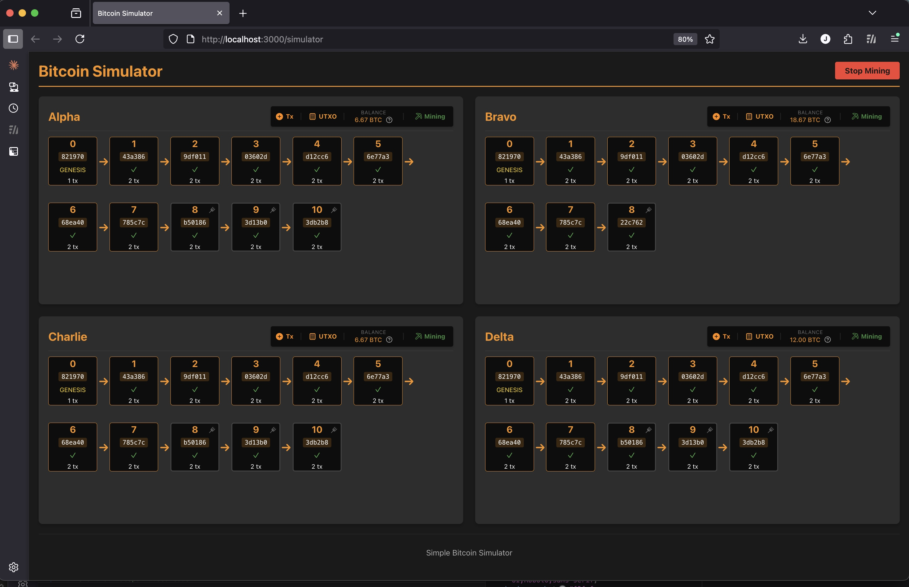

# Bitcoin Full Node Simulator

A simplified Bitcoin full node implementation built from scratch in TypeScript, featuring Nakamoto consensus and P2PKH transaction security using SHA-256 hashing and ECDSA signatures with the secp256k1 curve. The project includes an interactive React simulator that visualizes 4 nodes operating in a mesh network with real-time mining, blockchain synchronization, and UTXO tracking for each node. This educational implementation demonstrates core blockchain concepts including distributed consensus, cryptographic security, transaction validation, and peer-to-peer networking.



# Requirements P0

## Overview 
The goal of this document is to lay out the requirements for a bitcoin simulator. The purpose of this simulator is to implement Nakamoto consensus in its simplest form. After looking at what's available on the internet, there is no simple implementation that a developer could read in one sitting to understand the core of what Bitcoin's consensus algorithm does, and why it works. 

## Tech Stack
To implement this, we will create a React app in TypeScript and utilize web workers to simulate nodes' independent execution. We will use a mesh network and implement the most simple communication protocol across the web workers to implement the bitcoin simulator. To be clear, 1 web worker = 1 full node.

## Project Structure/Naming Conventions
Use camelCase for all file names across the app. The project structure should follow this pattern:

```
/src
  /app           # React app components
  /core          # Bitcoin simulator core logic
    /blockchain  # Blockchain data structures and operations
    /consensus   # Consensus mechanisms
    /mining      # Block mining logic
    /validation  # Transaction and block validation
  /network       # Mesh network implementation using web workers
  /config        # Configuration files
  /types         # TypeScript type definitions
  /utils         # Utility functions
```

## Module Boundaries

### Core Module
The core module is responsible for the blockchain logic:
- Block and transaction data structures
- UTXO management
- Block validation and mining
- State management of the blockchain

### Network Module
The network module is responsible for:
- Setting up and managing web workers
- Message passing between nodes
- Block and transaction propagation
- Peer discovery and management

### UI Components
The UI module is responsible for:
- Visualization of blockchain state
- Controls for simulation
- Block and transaction details display
- Node status monitoring

## Type Definitions
All interfaces should be centralized in a `types.ts` file:

```typescript
// types.ts
export interface TransactionInput {
  sourceOutputId: string;  // Format: "{txid}-{idx}" or "REWARDER_NODE_ID" for coinbase
}

export interface TransactionOutput {
  idx: number;        // Position index in the outputs array
  nodeId: string;     // Recipient node identifier
  value: number;      // BTC amount
}

export interface Transaction {
  txid?: string;      // Hash of inputs + outputs (calculated on creation)
  inputs: TransactionInput[];
  outputs: TransactionOutput[];
  timestamp?: number; // When the transaction was created
}

export interface UTXOSet {
  [sourceOutputId: string]: TransactionOutput;
}

export interface BlockHeader {
  transactionHash: string;  // SHA256 hash of all transactions
  timestamp: number;        // Local machine time
  previousHeaderHash: string; // Previous block's header hash
  ceiling: number;          // Target threshold value
  nonce: number;            // Value miners adjust to find valid hash
  height: number;           // Block height in the chain
}

export interface Block {
  header: BlockHeader;
  transactions: Transaction[];
  hash?: string;      // Calculated hash of the block header
}

export interface NodeState {
  nodeId: string;
  blockchain: Block[];
  utxo: UTXOSet;
  isMining: boolean;
  peerIds: string[];
}

export interface NetworkMessage {
  type: 'BLOCK_ANNOUNCEMENT' | 'BLOCK_REQUEST' | 'CHAIN_LENGTH_REQUEST' | 'CHAIN_LENGTH_RESPONSE';
  payload: any;
  sender: string;
  recipient: string | 'broadcast';
}
```

## Configuration Management
Create a configuration system to easily adjust parameters:

```typescript
// config.ts
export const SimulatorConfig = {
  // Mining parameters
  BLOCK_REWARD: 4,           // BTC rewarded to miners
  CEILING: "0x10000000000000000000000000000000000000000000000000000000000000000",  // Target difficulty
  // Ceiling explanation: 
  // - SHA-256 produces a 256-bit (64 hex character) hash
  // - This ceiling requires the first hex digit to be 0
  // - Roughly 1/16 of all hashes will be valid
  // - This should provide reasonable mining difficulty for web workers
  
  // Network parameters
  NODE_COUNT: 4,             // Number of nodes in the network
  
  // Transaction parameters
  REDISTRIBUTION_PERCENTAGE: 50, // Percentage of coins to redistribute
  
  // Constants
  REWARDER_NODE_ID: "COINBASE-REWARD",
  GENESIS_BLOCK_HASH: "0000000000000000000000000000000000000000000000000000000000000000"
};
```

## Validation Rules
All validation will use SHA-256 for hash verification. Add specific validation rules for transactions and blocks:

### Transaction Validation Rules
1. All transaction inputs must exist in the UTXO set, except for coinbase transactions
2. The sum of input values must be greater than or equal to the sum of output values
3. Coinbase transactions must have exactly one input with sourceOutputId equal to REWARDER_NODE_ID
4. Coinbase transaction reward must equal BLOCK_REWARD
5. Transaction IDs must be correctly calculated as the hash of inputs and outputs
6. Transaction outputs must have sequential idx values starting from 0
7. All values must be positive numbers

### Block Validation Rules
1. Block header hash (using SHA-256) must be below the ceiling value when comparing the full 256-bit hash
2. Previous header hash must match the hash of the previous block in the chain
3. Block must contain at least one transaction (the coinbase transaction)
4. First transaction must be a coinbase transaction
5. All transactions in the block must be valid according to transaction validation rules
6. Transaction hash in header must match the SHA-256 hash of all transactions
7. Block timestamp must be reasonable (not too far in future or past)

## Error Handling
Define how nodes handle validation errors:

1. **Invalid Transaction**:
   - Log the error with specific reason
   - Skip the transaction but continue processing other transactions
   - If a coinbase transaction is invalid, reject the entire block

2. **Invalid Block**:
   - Log the error with specific reason
   - Reject the entire block
   - Do not update local blockchain or UTXO set
   - Continue mining on previous valid block

## Block Creation Logic
Algorithm for transaction selection when mining blocks:

1. Create transactions with helper function for txid calculation:
   ```typescript
   // Helper function to calculate transaction ID
   function calculateTxid(inputs, outputs, blockHeight) {
     // Block height is included to ensure uniqueness across blocks
     // Without this, identical transactions in different blocks could have the same txid
     // This prevents UTXO collisions and mirrors Bitcoin's approach to coinbase uniqueness
     return sha256Hash(JSON.stringify({ 
       inputs, 
       outputs,
       blockHeight 
     }));
   }
   
   function createBlockTransactions(minerNodeId: string, peerNodes: string[], height: number): Transaction[] {
     // Create coinbase transaction first
     const coinbaseInputs = [{ sourceOutputId: CONFIG.REWARDER_NODE_ID }];
     const coinbaseOutputs = [{ idx: 0, nodeId: minerNodeId, value: CONFIG.BLOCK_REWARD }];
     
     const coinbaseTransaction = {
       inputs: coinbaseInputs,
       outputs: coinbaseOutputs,
       timestamp: Date.now(),
       blockHeight: height,
       txid: calculateTxid(coinbaseInputs, coinbaseOutputs, height)
     };
     
     // Calculate redistribution amounts
     const redistributionAmount = (CONFIG.BLOCK_REWARD * CONFIG.REDISTRIBUTION_PERCENTAGE) / 100;
     const amountPerPeer = redistributionAmount / peerNodes.length;
     
     // Create redistribution transaction using the coinbase output
     const coinbaseOutputId = `${coinbaseTransaction.txid}-0`;
     const redistributionInputs = [{ sourceOutputId: coinbaseOutputId }];
     
     // One output for each peer, plus change back to miner
     const redistributionOutputs = [
       ...peerNodes.map((peerId, idx) => ({
         idx,
         nodeId: peerId,
         value: amountPerPeer
       })),
       {
         idx: peerNodes.length,
         nodeId: minerNodeId,
         value: CONFIG.BLOCK_REWARD - redistributionAmount
       }
     ];
     
     const redistributionTransaction = {
       inputs: redistributionInputs,
       outputs: redistributionOutputs,
       timestamp: Date.now(),
       blockHeight: height,
       txid: calculateTxid(redistributionInputs, redistributionOutputs, height)
     };
     
     return [coinbaseTransaction, redistributionTransaction];
   }
   ```

3. Mining process with event handling:
   ```typescript
   function setupMiningProcess(node) {
     // Flag to control mining state
     let isMining = false;
     
     // Start mining a new block
     function startMining(previousHeaderHash, height) {
       // Don't start if already mining
       if (isMining) return;
       
       isMining = true;
       
       // Prepare the block to mine
       const transactions = createBlockTransactions(node.id, node.peerIds, height);
       
       const header = {
         transactionHash: sha256Hash(JSON.stringify(transactions)),
         timestamp: Date.now(),
         previousHeaderHash,
         ceiling: CONFIG.CEILING,
         nonce: 0,
         height
       };
       
       let block = { header, transactions };
       
       // Schedule the mining loop to run without blocking
       scheduleMiningIteration(block);
     }
     
     // Perform a small batch of mining attempts, then yield to event loop
     function scheduleMiningIteration(block) {
       // Using setTimeout with 0 defers execution until after event processing
       // This is critical for allowing the node to respond to network messages
       // Without this, the mining loop would block the thread and prevent
       // the node from receiving updates about new blocks or longer chains
       setTimeout(() => {
         // Check if we should stop mining (e.g., if longer chain was found)
         if (!isMining) return;
         
         // CRITICAL: Check if the blockchain has changed since we started mining
         // If the chain tip has changed, we need to stop and start mining on the new tip
         if (node.blockchain[node.blockchain.length - 1].hash !== block.header.previousHeaderHash) {
           console.log("Chain changed while mining, recomputing block template");
           // The chain has changed - we need to restart mining on the new tip
           const newTip = node.blockchain[node.blockchain.length - 1];
           stopMining();
           startMining(newTip.hash, newTip.header.height + 1);
           return;
         }
         
         // Perform a batch of mining attempts (adjust batch size as needed)
         // Smaller batches = more responsive to network events but more overhead
         // Larger batches = less responsive but more efficient mining
         const BATCH_SIZE = 1000;
         let found = false;
         
         for (let i = 0; i < BATCH_SIZE; i++) {
           let blockHash = sha256Hash(JSON.stringify(block.header));
           
           // Check if hash is valid
           if (blockHash < CONFIG.CEILING) {
             // Found a valid block!
             block.hash = blockHash;
             handleMinedBlock(block);
             found = true;
             break;
           }
           
           // Try next nonce
           block.header.nonce++;
         }
         
         // If we didn't find a valid block, schedule another batch
         // This creates a loop that periodically yields to the event system
         // allowing network messages to be processed between batches
         if (!found && isMining) {
           scheduleMiningIteration(block);
         }
       }, 0); // Zero timeout yields to the event loop without adding delay
     }
     
     // Handle successful mining
     function handleMinedBlock(block) {
       isMining = false;
       
       // Process the block locally
       node.addBlock(block);
       
       // Broadcast the block to peers
       node.broadcastBlock(block);
     }
     
     // Handle receiving a new block from the network
     function handleReceivedBlock(block) {
       // Validate the received block
       if (node.validateBlock(block)) {
         // If valid and creates a longer chain, adopt it
         if (node.addBlockToChain(block)) {
           // Stop current mining operation if we're adopting a new block
           stopMining();
           
           // Start mining on top of the new chain
           startMining(block.hash, block.header.height + 1);
         }
       }
     }
     
     // Stop current mining operation
     function stopMining() {
       isMining = false;
     }
     
     // Set up network message handlers
     node.onBlockReceived = handleReceivedBlock;
     node.onChainUpdated = (newTip) => {
       stopMining();
       startMining(newTip.hash, newTip.header.height + 1);
     };
     
     return {
       startMining,
       stopMining
     };
   }
   ```

## How nodes will interact with each other - Nakamoto consensus

All hashing in this system will use SHA-256. This includes transaction IDs, block header hashes, and any other cryptographic hashing requirements.

Blockchain nodes operate in a continuous cycle of communication, validation, and mining, with two primary communication functions:

1. **Chain Length Management**:
   - Nodes actively request blockchain length information from peers
   - Nodes identify chains with greater proof-of-work than their own
   - Nodes respond to similar requests from other nodes

2. **Block Propagation**:
   - Nodes broadcast newly mined blocks to the network
   - Nodes listen for block announcements from peers

When a node discovers a longer blockchain (representing greater cumulative work in this fixed-difficulty system), it:
1. Validates this chain by verifying that each block's header hash falls below the specified ceiling value
2. Adopts this superior chain upon successful validation
3. Redirects mining efforts toward extending this newly acquired blockchain

The node follows a consistent protocol whenever its blockchain changes:
1. Updates its local blockchain record
2. Reconstructs its UTXO set by reprocessing all historical transactions
3. When successful in mining, updates its own records before broadcasting the new block

This systematic process—validation, local record updates, UTXO reconstruction, and continued mining—preserves network-wide consensus by ensuring all nodes focus their efforts on the longest valid blockchain.

## Frontend
We aim to make a very simple frontend that displays the states of each of the 4 nodes. There will be a start/pause mining button which will kick off the simulation. Note that in the paused state, the nodes will still listen and request block length, but no new blocks will be mined.

Below the start/pause mining button will be a 4-panel setup where each panel will display the state of a node.

The theme of the app should be orange cypherpunk.

Each node's panel will display:
1. Node-ID and current status (mining/idle)
2. A horizontal view of its blockchain, which will be a list of boxes labeled by block number and showing the last few digits of its header hash. When you click on a block, you should get more details via a modal. The blocks and arrows will grow from left to right and wrap downwards. You should be able to scroll down in this view as the blocks grow.
3. A button for the UTXO. Clicking on this will pop up a modal, which will display the UTXO data structure.
4. Visual indication when a node mines a block.
5. Network connections visualization showing connections to other nodes.

## Notes on Implementation
1. The coinbase transaction must be the first transaction in a block.
2. Processing happens sequentially to ensure the coinbase outputs are available to later transactions.
3. The UTXO is updated after each transaction is processed - this is essential since we allow transactions in the block to spend the BTC produced by the coinbase transaction.
4. No security/cryptographic validation is included in this simplified model, but with the algorithm for our block transactions, each node only spends its own coinbase transaction.
5. Node IDs are used in place of Bitcoin addresses for simplicity.
6. Keep the implementation simple yet modular so the project can scale in complexity.

## Unique Genesis Block Design

This simulator implements a unique approach to genesis blocks that differs from the real Bitcoin network but serves as an excellent teaching tool for understanding Nakamoto consensus:

### Each Node Creates Its Own Genesis Block

In the real Bitcoin network, there is a single, hardcoded genesis block that all nodes agree on from the start. However, in this simulator:

1. **Node-specific Genesis Blocks**: Each node creates its own genesis block based on its `nodeId` through the `createGenesisBlock` function
2. **Self-Rewarding**: Each node's genesis block contains a coinbase transaction that rewards the node itself
3. **Direct Addition**: Genesis blocks bypass normal validation and are added directly to a node's blockchain

### Why This Design Is Pedagogically Valuable

This design choice creates an initial "forked" state across the network, which demonstrates several key aspects of Nakamoto consensus:

1. **Consensus Resolution**: The network starts in a divergent state (different genesis blocks) and must converge through the consensus mechanism
2. **Longest Chain Rule**: When a node mines a block on top of its genesis block, it creates a longer chain (with the genesis block at height 0 and the new block at height 1) that other nodes will eventually adopt over their own single genesis blocks (which are at height 0)
3. **Fork Resolution**: The simulator naturally demonstrates how the network resolves forks without requiring artificial creation of conflicting blocks

### Implementation Details

To support this design:

1. The `validateBlock` function explicitly rejects genesis blocks (blocks without a previous block reference)
2. The `addBlock` method in the Blockchain class rejects blocks with height 0
3. Genesis blocks are added directly to the blockchain via `push` in the `initializeChain` method
4. The chain validator skips validation for genesis blocks but still verifies they match the expected structure

This approach provides a clear demonstration of how Nakamoto consensus can resolve inconsistencies and converge on a single chain, even when starting from different initial states - a powerful illustration of the robustness of Bitcoin's consensus mechanism.

## Network Communication Architecture

The simulator implements a realistic peer-to-peer network communication layer that mirrors key aspects of Bitcoin's network protocol while remaining simple enough to understand.

### Mesh Network Topology

The network uses a fully-connected mesh topology where:

1. **All nodes connect to all other nodes**: This provides maximum redundancy and multiple paths for message propagation
2. **Deterministic node naming**: Nodes are named using the NATO phonetic alphabet (Alpha, Bravo, Charlie, etc.) in alphabetical order for easier debugging and consistent simulation runs
3. **Simulated network latency**: Random delays are introduced between nodes to simulate real-world network conditions

### Message Types and Communication Patterns

The network layer implements two complementary communication patterns:

#### 1. Push Model (Event-Driven)

* **Block Announcements**: When a node mines a new block, it immediately announces it to all peers
* **Implementation**: Uses a callback-based approach where the Node class triggers events that the network layer listens for
* **Example**: `node.setOnBlockBroadcast(this.handleBlockBroadcast.bind(this))`

#### 2. Pull Model (Polling-Based)

* **Height Requests**: Nodes periodically check with peers to discover longer chains
* **Chain Requests**: When a longer chain is discovered, the node requests the full chain
* **Implementation**: Uses direct method calls rather than callbacks, initiated by the network layer
* **Example**: `NetworkManager.startPeriodicHeightRequests()` which triggers height checks across all nodes

### Two-Step Chain Synchronization

The network implements an efficient two-step approach to chain synchronization:

1. **Height Exchange**: Nodes first exchange lightweight height information
2. **Chain Transfer**: Only when a longer chain is discovered does a node request the full chain

This approach minimizes unnecessary data transfer while ensuring nodes can quickly discover and adopt the longest valid chain.

### Message Handling Naming Conventions

The network communication layer uses clear naming conventions to distinguish between different message flows:

1. **Node to Network**: 
   - `setOnOutgoingMessage` - Sets up the callback for node-to-network communication
   - `routeMessageFromNode` - Handles messages sent from nodes to the network

2. **Network to Node**:
   - `deliverMessageToRecipients` - Routes messages to appropriate recipient nodes
   - `receiveIncomingMessage` - Processes messages received by a node from the network

This naming clearly separates the responsibilities and direction of message flow, making the code more readable and maintainable.